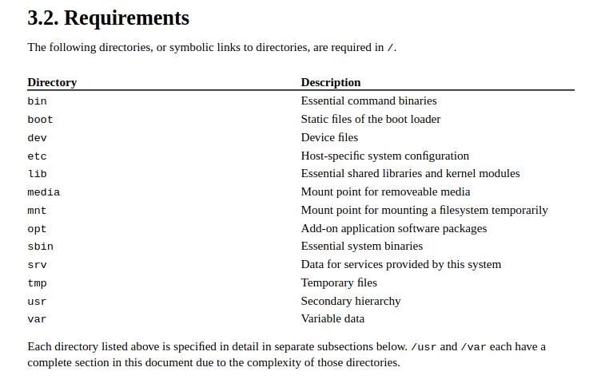

# Unix Fundamentals 101

## File systems

---

### Navigating the filesystem

---

Print Working Directory
`pwd`

```sh
baz@baz-pc:~$ pwd
/home/baz
baz@baz-pc:~$
```

---

List
`ls`

```sh
baz@baz-pc:~$ ls
Desktop    Downloads      Music    Pictures    Videos   Documents   Public    Templates
baz@baz-pc:~$
```

Long Listing
`ls -l`

```sh
baz@baz-pc:~$ ls -l
total 60
drwxr-xr-x 2 baz baz 4096 Feb  1 09:29 Desktop
drwxr-xr-x 2 baz baz 4096 Feb 10 17:14 Documents
drwxr-xr-x 5 baz baz 4096 Feb 10 17:26 Downloads
drwxr-xr-x 2 baz baz 4096 Feb  1 09:29 Music
drwxr-xr-x 4 baz baz 4096 Feb  1 10:22 Pictures
drwxr-xr-x 2 baz baz 4096 Feb  1 09:29 Public
drwxr-xr-x 2 baz baz 4096 Feb  1 09:29 Templates
drwxr-xr-x 2 baz baz 4096 Feb  1 09:29 Videos
baz@baz-pc:~$
```

Long Listing + Specify Directory
`ls -l /`

```sh
baz@baz-pc:~$ ls -l /
total 4194384
lrwxrwxrwx   1 root root          7 Oct 16 11:36 bin -> usr/bin
drwxr-xr-x   4 root root       4096 Jan 15 09:13 boot
dr-xr-xr-x   2 root root       4096 Oct 16 12:29 cdrom
drwxr-xr-x  21 root root       4700 Feb 10 17:30 dev
drwxr-xr-x 145 root root      12288 Feb  8 14:08 etc
drwxr-xr-x   3 root root       4096 Feb  1 09:29 home
lrwxrwxrwx   1 root root          7 Oct 16 11:36 lib -> usr/lib
lrwxrwxrwx   1 root root          9 Oct 16 11:36 lib64 -> usr/lib64
drwx------   2 root root      16384 Feb  1 09:20 lost+found
drwxr-xr-x   3 root root       4096 Feb  1 10:25 media
drwxr-xr-x   2 root root       4096 Oct 16 11:36 mnt
drwxr-xr-x   5 root root       4096 Feb  2 10:54 opt
dr-xr-xr-x 475 root root          0 Feb 10 12:30 proc
drwx------   9 root root       4096 Feb  6 14:19 root
drwxr-xr-x  40 root root       1100 Feb 10 12:41 run
lrwxrwxrwx   1 root root          8 Oct 16 11:36 sbin -> usr/sbin
drwxr-xr-x  13 root root       4096 Feb  1 09:52 snap
drwxr-xr-x   2 root root       4096 Oct 16 11:36 srv
-rw-------   1 root root 4294967296 Feb  1 09:24 swap.img
dr-xr-xr-x  13 root root          0 Feb 10 12:30 sys
drwxrwxrwt  23 root root       4096 Feb 10 17:37 tmp
drwxr-xr-x  12 root root       4096 Oct 16 11:36 usr
drwxr-xr-x  14 root root       4096 Oct 16 11:39 var
baz@baz-pc:~$
```

---

Change Directory
`cd`

```sh
baz@baz-pc:~$ cd /tmp
baz@baz-pc:/tmp$ pwd
/tmp
baz@baz-pc:/tmp$
```

---

Find
`find`

```sh
baz@baz-pc:~$ find /home/baz -type f -name test1.txt
/home/baz/Documents/test1.txt
baz@baz-pc:~$
```

---

### Working with disks in Linux

---

Disks in Linux are normally named `/dev/sda`, `/dev/sdb`, etc. If you are in a VM, they may be named `/dev/xvda`, `/dev/xvdb`, etc. The last letter (“a”, “b”, “c”..) relates to the physical hard drive in your computer. “a” is the first drive, “b” is the second.

---

### Configuring your drive with partitions

GNU Parted (Spawns a Sub-Shell)
`parted`

`parted /dev/sdb`
`print`
`mklabel msdos`
`print`
`mkpart primary 1 1G`
`set 1 boot on`
`mkpart primary 1G 5G`
`mkpart primary 5G 7G`
`mkpart primary 7G 8G`
`p`

for `boot`, `root`, `var` and `swap`

---

### Formatting partitions with new file systems

Make File System
`mkfs`

`man fs` lists types of file systems

The first partition contains `/boot` and will be `ext2`

`mkfs.ext2 /dev/sdb1`

The second and third partitions contain `/` and `/var` and will be `ext4`

`mkfs.ext4 /dev/sdb2`
`mkfs.ext4 /dev/sdb3`

The fourth and final partition is set aside for swap space

`mkswap /dev/sdb4`

---

### Step by Step

1. **Partitioning the Disk**:
   Use a tool like `fdisk` or `parted` to create partitions on the disk. For example:

   ```
   fdisk /dev/sdb
   ```

2. **Creating Filesystems**:
   After partitioning, create filesystems on each partition using appropriate filesystem creation commands like `mkfs`. For instance:

   ```
   mkfs.ext2 /dev/sdb1
   mkfs.ext4 /dev/sdb2
   mkfs.ext4 /dev/sdb3
   mkswap /dev/sdb4
   ```

3. **Mounting Filesystems**:
   Once the filesystems are created, mount them onto directories in the file system hierarchy using the `mount` command. For example:

   ```
   mount /dev/sdb1 /mnt
   ```

   Optionally, you can specify the filesystem type and mounting options explicitly:

   ```
   mount -t ext4 -o noatime /dev/sdb1 /mnt
   ```

   Remember that typically only the superuser can perform mounts.

By following these steps, you can effectively set up partitions, create filesystems, and mount them onto your system as needed.

---

### Mounting a filesystem

---

Mounting a filesystem is the act of placing the root of one filesystem on a directory, or mount point, of a currently mounted filesystem.

the filesystem of `/dev/sdb1 `will be mounted to the folder `/mnt`

anything inside `/dev/sdb1` will become accessible under `/mnt`

`mount -t ext4 -o noatime /dev/sdb1 /mnt`

`-t` filesystem type `-o` mounting options

`mount /dev/sdb1 /mnt`

---

1. **Identify the Filesystem and Device**: Determine the filesystem type and the device containing the filesystem you want to mount. In this example, let's say you have a filesystem on `/dev/sdb1`.

2. **Choose a Mount Point**: Decide where you want to mount the filesystem. This is typically an empty directory on the currently mounted filesystem. For this example, let's use `/mnt` as the mount point.

3. **Execute the Mount Command**: Use the `mount` command followed by the appropriate options and arguments. In its simplest form, the command looks like this:

   ```
   mount /dev/sdb1 /mnt
   ```

   This command instructs the system to mount the filesystem located at `/dev/sdb1` onto the directory `/mnt`.

4. **Verify the Mount**: After executing the command, verify that the filesystem is mounted correctly by listing the contents of the mount point directory. You should see the contents of `/dev/sdb1` accessible under `/mnt`.

5. **Unmounting the Filesystem (Optional)**: When you're done using the filesystem, you can unmount it using the `umount` command. For example:
   ```
   umount /mnt
   ```
   This command unmounts the filesystem previously mounted on `/mnt`.

Remember, mounting filesystems typically requires superuser privileges, so you may need to use `sudo` or have appropriate permissions.

---

### Automatic mounting using fstab

The `fstab`, or `file system table` is the file that configures automatic mounting at boot. It tabulates block devices, mount points, type and options for each mount.

The dump and pass fields control booting behavior.

Dumping is the act of creating a backup of the filesystem (often to tape), and is not in common use.

Pass is much more important. When the pass value is nonzero, the filesystem is analyzed early in the boot process by fsck, the file system checker, for errors.

The number, `fs_passno`, indicates priority. The root filesystem should always be 1, other filesystems should be 2 or more. A zero value causes checks to be skipped, an option often used to accelerate the boot process.

In `/etc/fstab`, there are a number of ways to specify the block device containing the filesystem . UUID, or universally unique identifier, is one common way in modern Linux based systems to specify a filesystem.

`cat /etc/fstab`

```sh
# <file system> <mount point>   <type>  <options>       <dump>  <pass>
# / was on /dev/nvme0n1p5 during curtin installation
/dev/disk/by-uuid/4b81daa2-ab59-4933-90d8-f94c927486ee / ext4 defaults 0 1
# /boot/efi was on /dev/nvme0n1p1 during curtin installation
/dev/disk/by-uuid/6619-0640 /boot/efi vfat defaults 0 1
/swap.img       none    swap    sw      0       0
```

filesystem checker `fsck`

---

### Step by Step:

```sh
$ cat /etc/fstab
# <file system> <mount point>  <type>  <options>         <dump>  <pass>
/dev/sda5         /            ext4    errors=remount-ro 0       1
/dev/sda6         none         swap    sw                0       0
/dev/sda1         /boot/efi    auto    auto              0       0
```

1. **Boot Process Initialization**: When the system boots up, it initializes various components including hardware detection, loading of kernel modules, and filesystem mounting.

2. **Reading /etc/fstab**: During the boot process, the system reads the `/etc/fstab` file to determine which filesystems need to be mounted automatically and their respective configurations.

3. **Mounting Root Filesystem (/)**: The first entry in the `/etc/fstab` file typically corresponds to the root filesystem (`/`). In this example:

   - `/dev/sda5` is the block device representing the root filesystem.
   - `ext4` is the filesystem type.
   - `errors=remount-ro` indicates that if errors are encountered, the filesystem should be remounted read-only.
   - `0` in the `dump` field signifies that this filesystem should not be backed up.
   - `1` in the `pass` field indicates that this filesystem should be checked by `fsck` during boot, with a priority of 1.

4. **Mounting Swap Partition**: The second entry in the `/etc/fstab` file corresponds to the swap partition. In this example:

   - `/dev/sda6` is the block device representing the swap partition.
   - `swap` indicates the filesystem type.
   - `sw` in the options field specifies swapping.
   - `0` in the `dump` field means this filesystem should not be backed up.
   - `0` in the `pass` field means no filesystem consistency check is needed during boot.

5. **Mounting EFI System Partition**: The third entry in the `/etc/fstab` file corresponds to the EFI system partition. In this example:

   - `/dev/sda1` is the block device representing the EFI system partition.
   - `auto` is used for the filesystem type, allowing the system to auto-detect the filesystem type.
   - `auto` in the options field means the partition will be automatically mounted during boot.
   - `0` in the `dump` field means this filesystem should not be backed up.
   - `0` in the `pass` field means no filesystem consistency check is needed during boot.

6. **Filesystem Mounting**: During the boot process, the system mounts the specified filesystems according to the configurations in `/etc/fstab`.

7. **Filesystem Checks**: For filesystems with a non-zero `pass` value, the `fsck` utility is invoked during boot to check for errors. The priority of checking is determined by the `pass` value. In this example, the root filesystem (`/`) is checked with the highest priority. If errors are found, they are attempted to be fixed.

8. **Completion of Boot Process**: Once all filesystems are mounted and any necessary checks are completed, the boot process continues, and the system becomes available for user interaction.

This process ensures that the specified filesystems are automatically mounted with the correct configurations during system boot, ensuring a smooth and reliable startup.

---

### Automatic mounting using autofs

`autofs` is another way to tabulate filesystems for mounting. It is different from the `/etc/fstab` because the filesystems listed in `auto.master` are not mounted at boot. The automounter allows the system to mount filesystems on demand, then clean up those filesystems when they are no longer being used.

The `auto.master` file controls the `autofs` service:

```sh
$ cat /etc/auto.master

/home -rw,hard,intr,nosuid,nobrowse bigserver:/exports/home/&
/stash ldap:ou=auto_stash,ou=Autofs,dc=example,dc=com -rw,hard,intr,nobrowse
```

In the above example, the system mounts home directories for each user from a remote NFS server. The filesystem remains unmounted until the user logs in, and is unmounted a short time after the user logs out. The automounter is triggered by an attempt to cd into `/home/<key>`. It will then attempt to find an NFS share on `/exports/home/<key>` and mount it on `/home/key`, then allow the `cd` command to return successfully. The `/home` example above is using the `&` expansion syntax.

The second line is using the LDAP syntax to look up a key under `/stash/<key>` in LDAP. LDAP will be covered later in the curriculum.

The `auto.master` file is known as `auto_master` on FreeBSD, Solaris, and Mac OS X.

---

Passing options to the `mount` command, or inserting them into the `/etc/fstab` file, control how the filesystem behaves.
Different filesystems at different versions support different options, but some options are ubiquitous.

`async`

The `async` option sets writing operations to the filesystem to be asynchronous.
This means that the `cp` command will exit normally before the entire copy is done, and that the system will persist the files to the disk at some point later on. You don’t have a lot of guarantees here about when that will happen, though for a generally unloaded system you won’t have to wait long.
It is also hard to tell when the filesystem is actually done with the copy.
The `sync` utility can be used to force a filesystem sync to immediately persist to disk.
The opposite of this option, the `sync` option is the default on most filesystems.

`noatime`

- The `noatime` option tells the filesystem not to keep track of `atime` or access time.
- `inode`s maintain three dates: `ctime` (change time), `mtime` (modification time), and `atime`.
- By default, when a user reads a file, the operating system updates its `atime` in the `inode`.
- This constant updating of atime can impact disk performance, especially for systems with many small files accessed frequently.
- Administrators often disable atime on filesystems to improve performance.
- It's important to note that `atime` is not primarily a security or auditing feature.
- Regular users with appropriate permissions can manipulate atime using the `touch` utility to set it to a desired time in the past.
- Contrary to common belief, `ctime` doesn't store a file's creation time.
- `ctime` represents when the file's attributes or contents were last changed, while `mtime` records changes specifically to the file's contents.

---

### How filesystems work

---

### Inodes

http://en.wikipedia.org/wiki/Inode

The `inode` (index node) is a data structure in a Unix-style file system that describes a file-system object such as a file or a directory. Each inode stores the attributes and disk block locations of the object's data. File-system object attributes may include metadata (times of last change, access, modification), as well as owner and permission data. A directory is a list of inodes with their assigned names. The list includes an entry for itself, its parent, and each of its children.

What they contain, how they work

The POSIX standard dictates files must have the following attributes:

- File size in bytes.
- A device ID.
- User ID of file’s owner.
- Group ID of file.
- The file’s mode (permissions).
- Additional system and user flags (e.g. append only or ACLs).
- Timestamps when the inode was last modified (ctime), file content last modified/accessed (mtime/atime).
- Link count of how many hard links point to the inode.
- Pointers to the file’s contents.

---

### File System layout

File system hierarchy standard is a reference on managing a Unix filesystem or directory structure.

http://www.pathname.com/fhs/



---

### Filesystem objects

Filesystem contain more than just files and directories. Talk about devices (mknod), pipes (mkfifo), sockets, etc.
